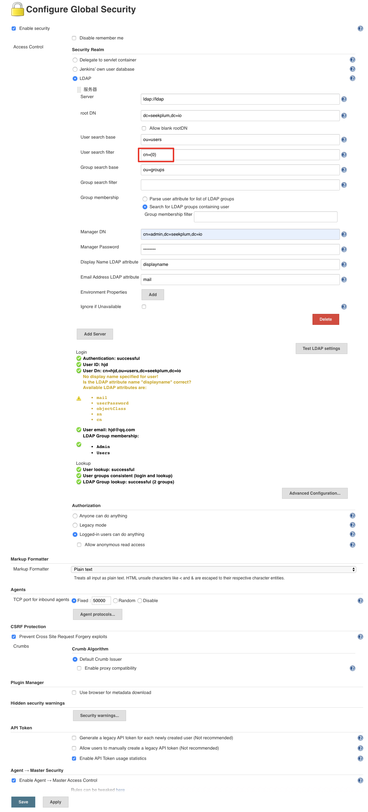

# 部署开发环境

## 分步操作

可以按照脚本内容，依次启动服务，完成部署

```bash
bash ./install.sh
```

## 一键搭建

通过 `docker-compose` 启动所有服务

```bash
bash ./deploy.sh
```

## DRONE_SECRET

由下面命令生成的

```bash
openssl rand -hex 16
```

## Jenkins

启动后需要手动配置 `LDAP` 登录

* 1.安装 `LDAP` 插件
* 2.配置LDAP服务, 配置见下图


