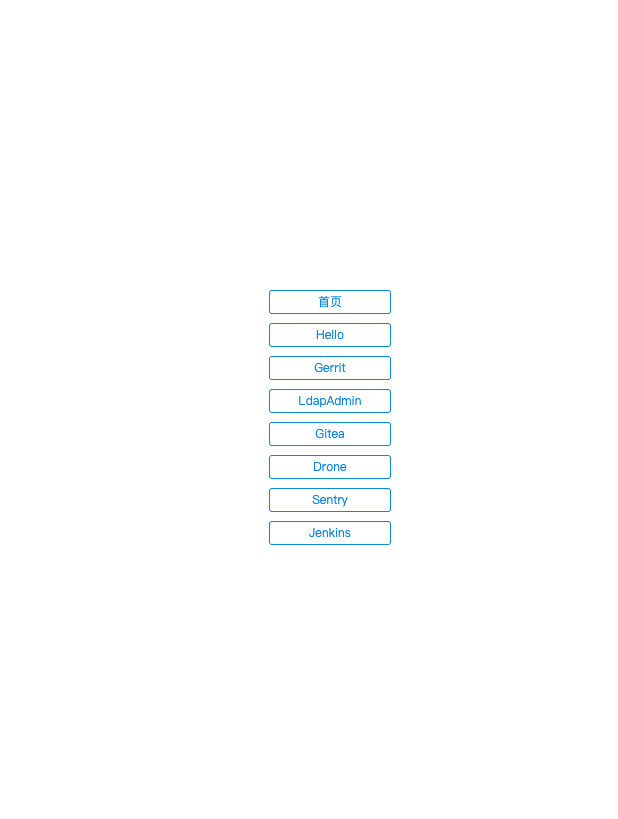

# 部署开发环境

## 分步操作

可以按照脚本内容，依次启动服务，完成部署

```bash
bash ./install.sh
```

## 一键搭建

通过 `docker-compose` 启动所有服务

```bash
bash ./deploy.sh deploy clear_volumes
```

## DRONE_SECRET

由下面命令生成的

```bash
openssl rand -hex 16
```

## Jenkins

启动后需要手动配置 `LDAP` 登录

* 1.安装 `LDAP` 插件
* 2.配置LDAP服务, 配置见下图


## Sentry

```bash
git clone git@github.com:getsentry/onpremise.git

git checkout 9.1.2
```

## SwitchyOmega

新建一个情景模式，类型选择 `PAC情景模式`，填入以下内容保存即可

```javascript
function FindProxyForURL(url, host) {
    if (dnsDomainIs(host, "seekplum.top")
            || dnsDomainIs(host, "blog.seekplum.top")
            || dnsDomainIs(host, "ldap.seekplum.top")
            || dnsDomainIs(host, "gerrit.seekplum.top")
            || dnsDomainIs(host, "git.seekplum.top")
            || dnsDomainIs(host, "sentry.seekplum.top")
            || dnsDomainIs(host, "drone.seekplum.top")) {
        return "PROXY 127.0.0.1:8080";
    }
    return "DIRECT";
}
```

## 访问

配置代理后在浏览器输入 `seekplum.top` 则可以看到如下界面


